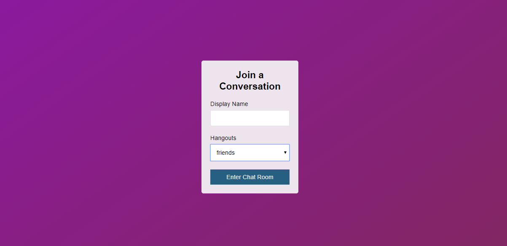
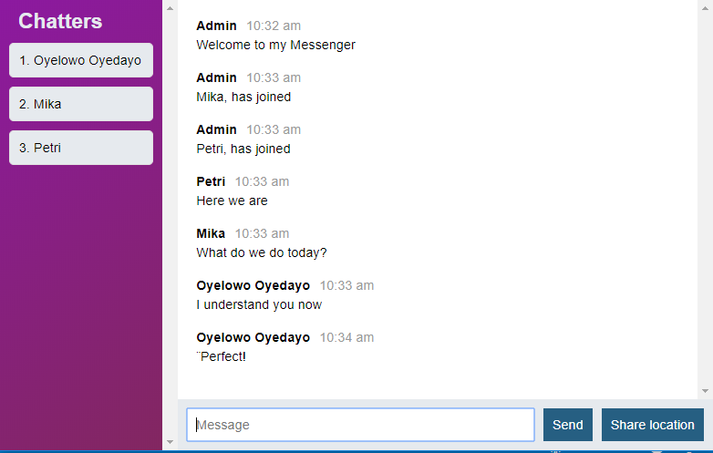

# node-live-messenger

[Demo live here](https://node-live-messenger.herokuapp.com/)

- This is an early version of my chat app.
- !Language and libraries used: JavaScript, Node, Express, MongoDB and Mongoose, Mocha, Chai, ExpectJS, supertest etc

